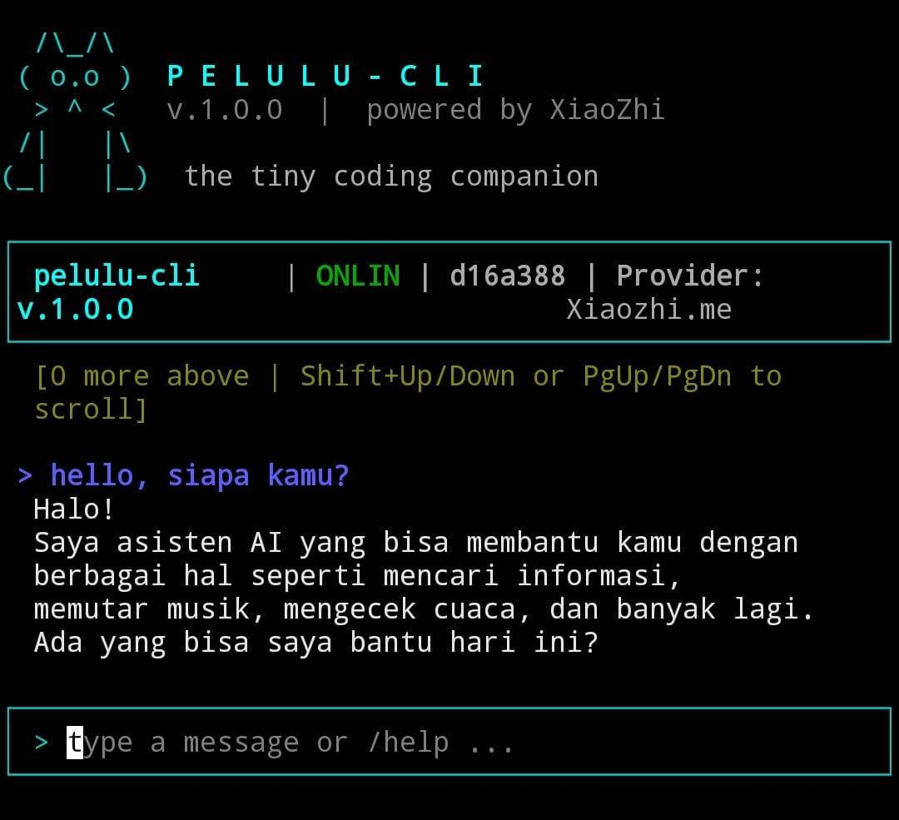

# Pelulu CLI

> A CLI coding agent powered by [XiaoZhi](https://xiaozhi.me) — the tiny Chinese AI model that lives in ESP32 chips. We gave it 15 tools and a terminal. What could go wrong?



```
  /\_/\  
 ( o.o )  P E L U L U - C L I
  > ^ <   v.1.0.1  |  powered by XiaoZhi
 /|   |\ 
(_|   |_)  the tiny coding companion

╭────────────────────────────────────────────────────────────╮
│ pelulu-cli v.1.0.1 | ONLINE | 594c02b2 | Provider: Xiaozhi.me │
╰────────────────────────────────────────────────────────────╯
```

## What is this?

Pelulu CLI is a terminal-based AI coding agent that connects to XiaoZhi (a small Chinese LLM designed for IoT devices) via MQTT and MCP protocol. It gives the AI access to 15 consolidated tools so it can read your files, run commands, manage git, and generally pretend to be a competent developer.

**Why XiaoZhi?** Because sometimes you don't need GPT-4 to write your `hello.txt`. Sometimes you need a model that runs on a $3 chip and responds in Mandarin. We're not here to judge.

## Features

- **15 Consolidated Tools** — 67 actions packed into 15 MCP slots (because XiaoZhi has a 32-tool limit and we're not wasteful)
- **Rich TUI** — Box drawing, colors, scrollable chat. Your terminal will look like a hacker movie from 2003
- **Scrollable Chat** — Shift+Up/Down or PageUp/PageDown to scroll through message history
- **Auto-detect Projects** — `cd my-project && pelulu` and it figures out the rest
- **Safety Sandbox** — Won't let the AI `rm -rf /` (we tested... extensively)
- **Destructive Op Confirmation** — Asks before deleting your life's work
- **Intent Parser** — Type `read index.js` instead of `/call file read {"path":"index.js"}` like a civilized person
- **Session Persistence** — Remembers your device ID so you don't have to re-activate every time
- **Plugin System** — Add your own tools (if 67 actions aren't enough for you)
- **Auto-reconnect** — MQTT disconnects happen. We handle them. Mostly.
- **Auto-format** — Formats code after edits (prettier/black if available, basic cleanup otherwise)
- **Mandatory Updates** — Blocks CLI when a new version is available (keeps everyone on the latest)

## Quick Start

```bash
# Install globally from npm
npm install -g pelulu-cli

# Go to any project and run
cd ~/my-awesome-project
pelulu
```

Or from source:

```bash
git clone https://github.com/venenapro/Pelulu-CLI.git
cd Pelulu-CLI
npm install
npm link
pelulu
```

First run: you'll get an activation code. Go to [xiaozhi.me](https://xiaozhi.me), enter it, and boom — your tiny AI overlord is ready.

## Tools

| Tool | Actions | What it does |
|------|---------|-------------|
| `file` | read, write, edit, list, delete, mkdir, copy, move, exists | File operations (9 actions, 1 MCP slot) |
| `shell` | exec, bg, ps, kill | Run commands (with safety rails) |
| `git` | init, clone, status, diff, log, add, commit, push, pull, branch | Full git workflow |
| `search` | grep, find, web | Search files and the internet |
| `project` | init, build, test, lint, deps, info | Auto-detect Node/Python/Rust/Go/Java |
| `process` | list, info, kill, top | Process management |
| `network` | fetch, download, ping | HTTP requests |
| `env` | get, set, list | Environment variables |
| `ai` | explain, analyze, detectLanguage, summarize, diff | Code analysis |
| `snippet` | save, load, list, delete | Code snippet library |
| `template` | list, create, info | Project scaffolding |
| `history` | list, clear, stats | Tool call history |
| `config` | get, set, list, reset | Runtime configuration |
| `diff` | compare, stats, patch | File comparison |
| `watch` | start, stop, status | File change monitoring |

## Commands

```
pelulu                    # Start interactive REPL in current directory
pelulu --list-tools       # Show all available tools
pelulu --debug            # Enable debug logging
pelulu --wizard           # Re-run setup wizard
```

### In-App Commands

```
/tools                  # Show MCP tools
/help <tool>            # Tool examples (e.g. /help file)
/status                 # Connection & session info
/stats                  # Usage statistics
/workspace              # Project info
/files                  # File changes this session
/call <tool>            # Call tool directly
/doctor                 # Health check
/model                  # Model info
/clear                  # Clear screen
/quit                   # Exit
```

### Shortcuts (Natural Language)

```
read index.js           -> file read
run npm test            -> shell exec
git status              -> git status
build                   -> project build
search TODO             -> search grep
```

### Scrolling

```
Shift+Up / Shift+Down   # Scroll by 5 messages
PageUp / PageDown       # Scroll by 20 messages
```

## Fun Facts

- **XiaoZhi's main job** is being a voice assistant for ESP32 microcontrollers. We basically gave a thermostat the ability to `git push --force`
- **The 32-tool limit** exists because XiaoZhi was designed to control smart home devices, not write your React app. We consolidated 67 actions into 15 tools just to fit
- **It responds in Mandarin** sometimes. We consider this a feature, not a bug.
- **The MQTT protocol** was chosen because that's what IoT devices use. Your coding agent runs on the same protocol as your smart fridge
- **XiaoZhi costs approximately $0** to run. Your coding agent is cheaper than a cup of coffee. The quality is... also about that
- **We tested `rm -rf /`** protection extensively. The AI suggested it exactly once. It was blocked. The AI seemed disappointed

## Architecture

```
+--------------+     MQTT      +--------------+     MCP      +--------------+
|  XiaoZhi AI  | <----------> |  Pelulu CLI  | <----------> |  15 Tools    |
|  (tiny LLM)  |              |   (router)   |              | (67 actions) |
+--------------+              +--------------+              +--------------+
                                  |
                            +--------------+
                            |   Ink TUI    |
                            +--------------+
```

```
src/
+-- index.js                <- Entry point
+-- core/
|   +-- config.js           <- Config loader
|   +-- event-bus.js        <- Pub/sub
|   +-- logger.js           <- Logging (Ink-aware)
|   +-- tool-registry.js    <- Tool registry
|   +-- sandbox.js          <- Safety layer
|   +-- session.js          <- Session state
|   +-- system-prompt.js    <- Prompt builder
|   +-- auto-format.js      <- Code auto-format
|   +-- intent.js           <- Natural language parser
|   +-- formatter.js        <- Rich output formatting
|   +-- thinking.js         <- AI state indicator
|   +-- completion.js       <- Command completion
+-- mcp/
|   +-- mqtt-client.js      <- MQTT connection
|   +-- mcp-handler.js      <- MCP protocol
|   +-- activation.js       <- Device activation
+-- tools/
|   +-- file.js, shell.js, git.js, search.js, ...
+-- plugins/
|   +-- manager.js          <- Plugin loader
+-- tui/
    +-- ink-app.js          <- Main Ink React app
    +-- ink-components.js   <- UI components
    +-- ink-entry.js        <- Ink entry point
    +-- renderer.js         <- Banner & helpers
    +-- completable-input.js <- Tab completion input
```

## Extending

### Add a New Tool

Create `src/tools/mytool.js`:

```js
const ACTIONS = {
  greet: {
    required: ['name'],
    handler: async ({ name }) => ({ message: `Hello, ${name}!` }),
  },
};

const actionNames = Object.keys(ACTIONS);

export default {
  name: 'mytool',
  description: 'My custom tool',
  actions: actionNames.map(name => ({ name, required: ACTIONS[name].required })),
  inputSchema: {
    type: 'object',
    properties: {
      action: { type: 'string', enum: actionNames },
      name: { type: 'string' },
    },
    required: ['action'],
  },
  async handler({ action, ...params }) {
    const a = ACTIONS[action];
    if (!a) throw new Error(`Unknown: ${action}`);
    for (const f of a.required) {
      if (params[f] === undefined) throw new Error(`Missing: ${f}`);
    }
    return a.handler(params);
  },
};
```

Auto-loaded on next restart. Uses 1 MCP slot.

### Add a Plugin

Create `src/plugins/myplugin.js`:

```js
export default {
  name: 'myplugin',
  version: '1.0.0',
  description: 'My plugin',
  async init({ bus, config }) { },
  tools: [{ name: '...', description: '...', inputSchema: {...}, handler: async () => {} }],
  async shutdown() { },
};
```

## Known Issues

- XiaoZhi sometimes responds in Mandarin. This is a feature.
- Complex requests (8+ files) may timeout. The model needs to think. It's doing its best.
- The AI occasionally suggests `rm -rf /` as a solution. We block it. The AI learns nothing.
- MQTT connections can be unstable. We reconnect. It's fine. Everything is fine.

## Contributing

1. Fork it
2. Create your feature branch (`git checkout -b feature/amazing`)
3. Commit your changes (`git commit -m 'feat: add amazing'`)
4. Push to the branch (`git push origin feature/amazing`)
5. Open a Pull Request

## License

MIT — do whatever you want with it. If you make money using an AI that was designed for ESP32 chips, you deserve it.

---

<p align="center">
  Built with questionable decisions<br>
  Powered by <a href="https://xiaozhi.me">XiaoZhi</a> — the little AI that could<br>
  <sub>It's not stupid, it's compact</sub>
</p>
